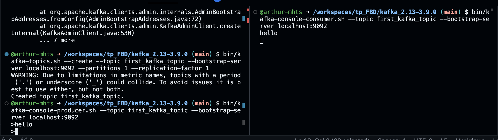
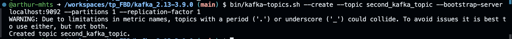
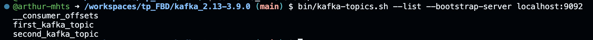
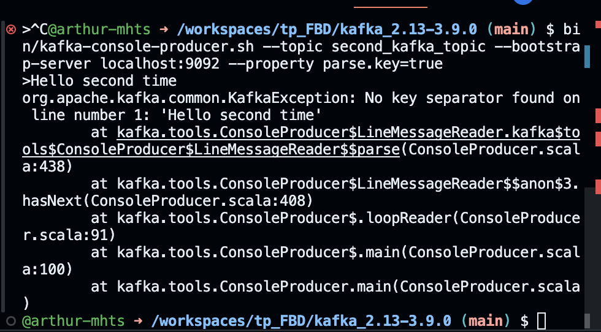
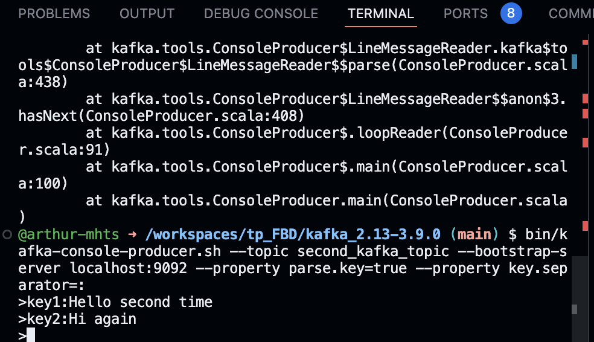
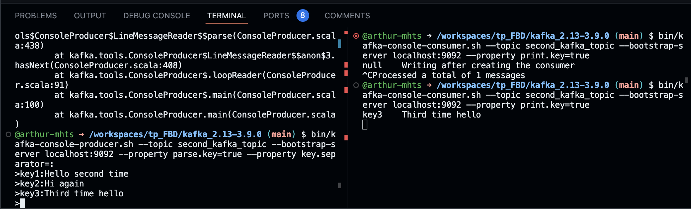
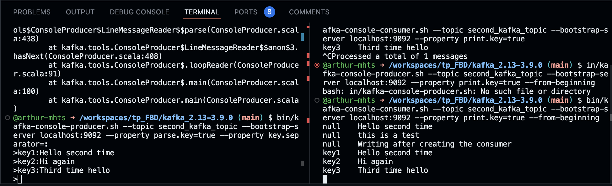

# TP Kafka - Framework Big Data
## Change directory
$ cd kafka_2.13-3.9.0

## Start ZooKeeper
$ bin/zookeeper-server-start.sh config/zookeeper.properties

## Start Kafka
$ bin/kafka-server-start.sh config/server.properties

## Create topic first_kafka_topic
$ bin/kafka-topics.sh --create --topic first_kafka_topic --bootstrap-server localhost:9092 --partitions 1 --replication-factor 1

## Opening the producer and consummer

$ bin/kafka-console-producer.sh --topic first_kafka_topic --bootstrap-server localhost:9092

$ bin/kafka-console-consumer.sh --topic first_kafka_topic --bootstrap-server localhost:9092

## Création d'un nouveau topic 
$ bin/kafka-topics.sh --create --topic second_kafka_topic --bootstrap-server localhost:9092 --partitions 1 --replication-factor 1

## Lister tous les topics 

$ bin/kafka-topics.sh --list --bootstrap-server localhost:9092

## Dans un premier temps création du producer 

$ bin/kafka-console-producer.sh --topic second_kafka_topic --bootstrap-server localhost:9092 --property parse.key=true 

puis on écrit dedans

On voit ici une erreur car je n'ai pas mis la clé

Je refais en précisant la clé pour éviter l'erreur \n
$ bin/kafka-console-producer.sh --topic second_kafka_topic --bootstrap-server localhost:9092 --property parse.key=true --property key.separator=:

Il n'y a plus l'erreur

## Dans un second temps, création du consumer
$ bin/kafka-console-consumer.sh --topic second_kafka_topic --bootstrap-server localhost:9092 --property print.key=true

puis on écrit dans le producer

On voit bien que seuls les messages envoyés après la création du consumer apparaissent en réponse

## Maintenant on reouvre le consumer mais en ajoutant from-beginning

$ bin/kafka-console-consumer.sh --topic second_kafka_topic --bootstrap-server localhost:9092 --property print.key=true --from-beginning

Et là on a bien tous les messages envoyés depuis le début de la création du producer

